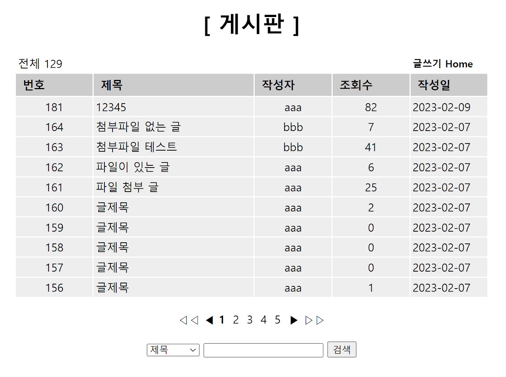
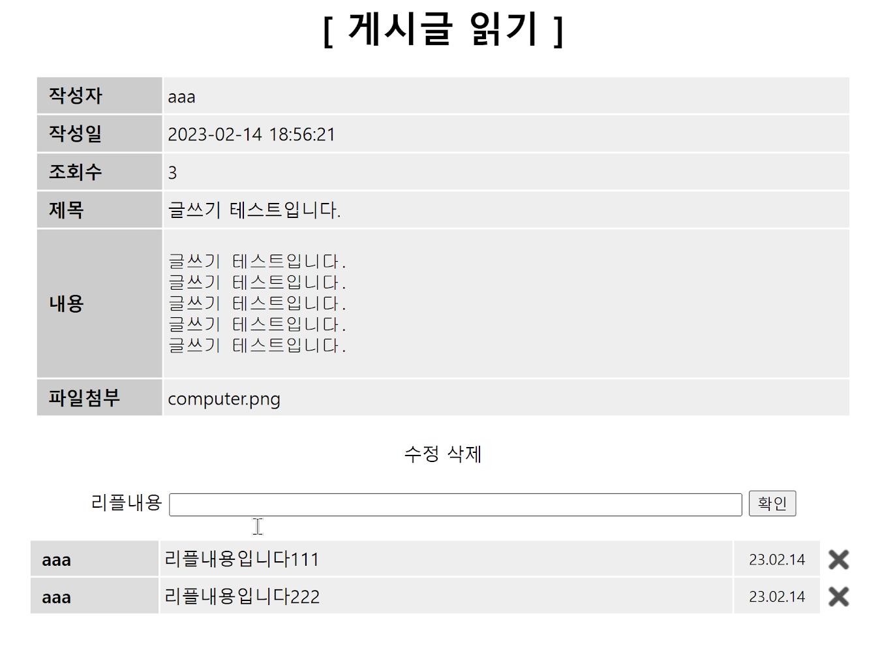
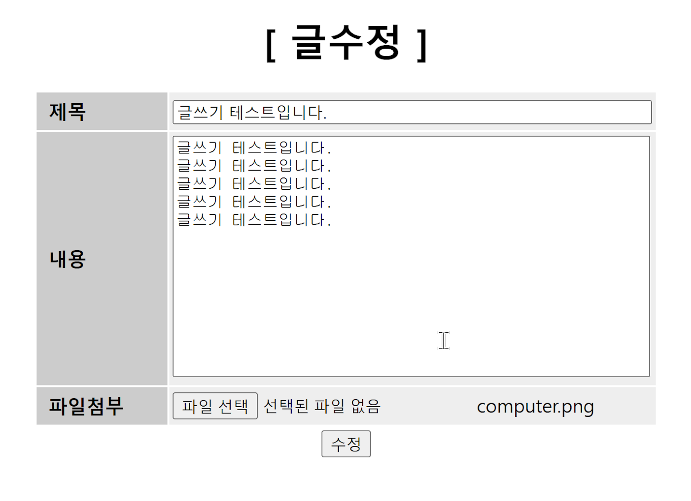
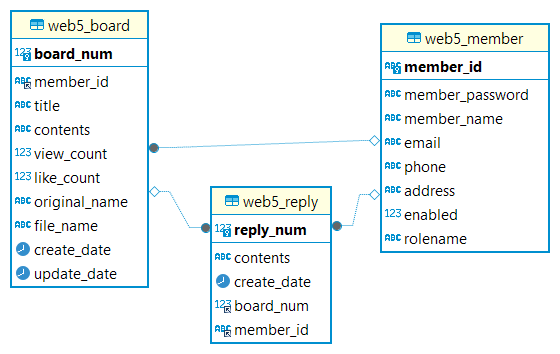

# web5 プロジェクト

## 概要

`web5` プロジェクトは、Spring Web、Spring Security、JPA、Java、Thymeleaf、AJAX、jQuery、JavaScriptを使用して作成されたシンプルな取引掲示板アプリケーションです。このプロジェクトはMySQLデータベースを使用し、会員登録、ログイン、ログアウト、投稿作成、コメント機能を提供します。

## 主な機能

- **会員登録フォーム**: `/member/joinForm`
- **会員登録処理**: `/member/join`
- **ログイン**: `/member/loginForm`
- **ログアウト**: `/member/logout`
- **情報修正**: `/member/info`
- **掲示板の投稿一覧**: `/board/list`


- **投稿作成**: `/board/write`

- **投稿削除**: `/board/delete`

## プロジェクト設定

- **基本パッケージ**: `net.datasa.web5`
- **依存関係**: 基本4つ + JPA + MySQLドライバ + Security

## パッケージ構造

```
net.datasa.web5
│
├── controller
│   └── [コントローラクラス]
│
├── service
│   └── [サービスクラス]
│
├── domain
│   ├── entity
│   │   └── [エンティティクラス]
│   ├── dto
│   │   └── [DTOクラス]
│   └── [ドメイン関連クラス]
│
├── repository
│   └── [リポジトリインターフェース]
│
├── security
│   ├── WebSecurityConfig.java
│   ├── AuthenticatedUser.java
│   └── AuthenticatedUserDetailsService.java
│
└── util
    └── [ユーティリティクラス]
```

## テーブル構造



--- 


# web5 프로젝트

## 소개

`web5` 프로젝트는 Spring Web, Spring Security, JPA, Java, Thymeleaf, AJAX, jQuery, JavaScript를 사용하여 만든 간단한 거래 게시판 애플리케이션입니다. 이 프로젝트는 MySQL 데이터베이스를 사용하여 회원가입, 로그인, 로그아웃, 게시글 작성 및 댓글 달기 기능을 제공합니다.
## 주요 기능

- **회원가입 양식**: `/member/joinForm`
- **회원가입 처리**: `/member/join`
- **로그인**: `/member/loginForm`
- **로그아웃**: `/member/logout`
- **정보 수정**: `/member/info`
- **게시판 글 목록**: `/board/list`


- **글쓰기**: `/board/write`

- **글 삭제**: `/board/delete`

## 프로젝트 설정

- **기본 패키지**: `net.datasa.web5`
- **의존성**: 기본 4개 + JPA + MySQL 드라이버 + Security

## 패키지 구조

```
net.datasa.web5
│
├── controller
│   └── [컨트롤러 클래스들]
│
├── service
│   └── [서비스 클래스들]
│
├── domain
│   ├── entity
│   │   └── [엔티티 클래스들]
│   ├── dto
│   │   └── [DTO 클래스들]
│   └── [도메인 관련 클래스들]
│
├── repository
│   └── [레포지토리 인터페이스들]
│
├── security
│   ├── WebSecurityConfig.java
│   ├── AuthenticatedUser.java
│   └── AuthenticatedUserDetailsService.java
│
└── util
    └── [유틸리티 클래스들]
```

## 테이블 구조

